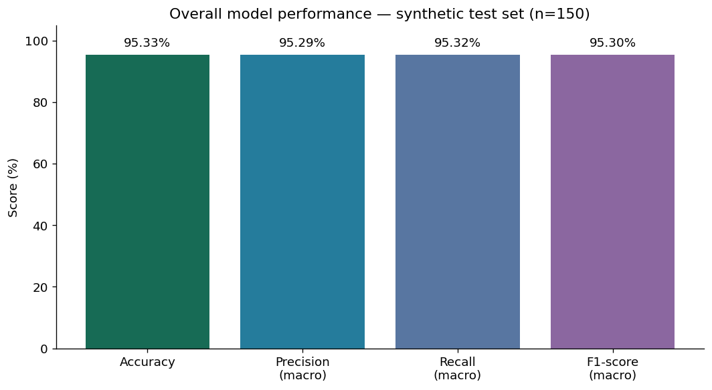
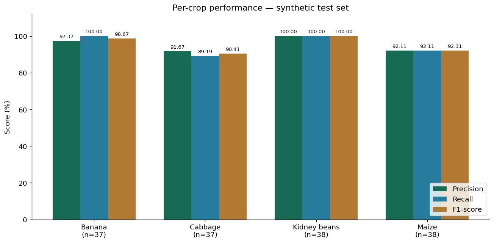
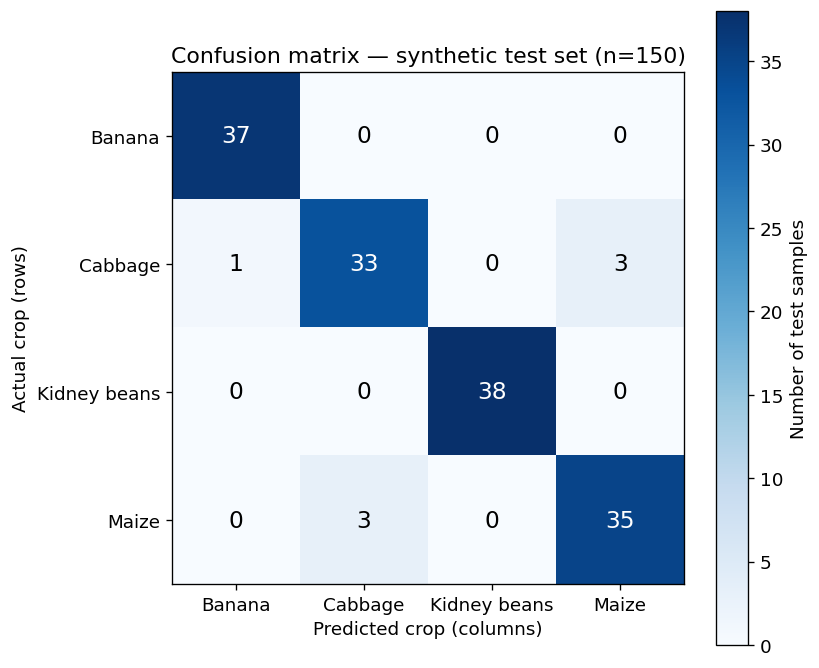

# Project procedure, executed notebook and results

[Open the existing Colab notebook](https://colab.research.google.com/drive/1QyC-t7w4dpLWgi2hc77Jppj-xffhK8JT?usp=sharing) | [View executed notebook on GitHub](../notebooks/ML-IoT-based-FYP.ipynb) | [Run the GitHub notebook in Colab](https://colab.research.google.com/github/Melingasuk/ML-IoT-based-FYP/blob/main/notebooks/ML-IoT-based-FYP.ipynb)

## Reproduction and evaluation

The notebook has 12 separately runnable sections: setup, synthetic generation, stratified split, training, validation, held-out evaluation, overall graph, per-crop graph, confusion matrix, missing/invalid inputs, functional tests, and ESP32 header export/reproduction commands.

The completed Colab run on 25 September 2026 used source commit `27bbce9e2712cb9fafe77b9ec19a40ae8d19ab55`. It generated 1,000 synthetic records, split 700/150/150, and obtained 143/150 correct test predictions (95.33%). Macro precision/recall/F1 were 95.29%/95.32%/95.30%. Validation accuracy was 91.33%. All 14 functional tests passed after restoring the original C++ example omitted from the first source upload. These are synthetic/software results, not field or physical hardware validation.

[Plain Python workflow](../notebooks/reproduce_colab.py) | [Actual Colab output transcript](../results/colab_execution_results.txt)

## Performance graphs

The PNGs above are extracted from the executed Colab outputs. Running the graph cells also saves 300-dpi copies in the runtime under training/reports/figures.

## Appendices and implementation

[Complete supplied appendices A–G and source listings](Appendices_Procedure_and_Source.txt)

The appendix is a historical record supplied for publication, with private configuration values removed. Its embedded source listings can differ from later executable source. In particular, historical pump, sensor-validation and missing-input behavior must not be treated as newly verified hardware results.

- [Synthetic generator](../training/src/soil_ml/synthetic.py), [split/train/evaluation](../training/src/soil_ml/train.py), [C export](../training/src/soil_ml/export_c.py)
- [Missing/invalid input wrapper](../edge/predict.py), [functional tests](../training/tests)
- [Current integrated ESP32 firmware](../soilhealth-iot/firmware/SoilHealthGateway)
- [MQTT receiver, SQLite and cloud bridge](../soilhealth-iot/receiver)
- [Dashboard HTML, CSS, JavaScript and Netlify functions](../dashboard)
- [Synthetic dataset](../training/data/synthetic/soil_synthetic_prototype.csv), [saved model and metadata](../training/models), [historical reports](../training/reports)

Use credential templates locally. No passwords, private phone numbers or flashed binaries are published. The Colab export does not upload firmware to an ESP32.
